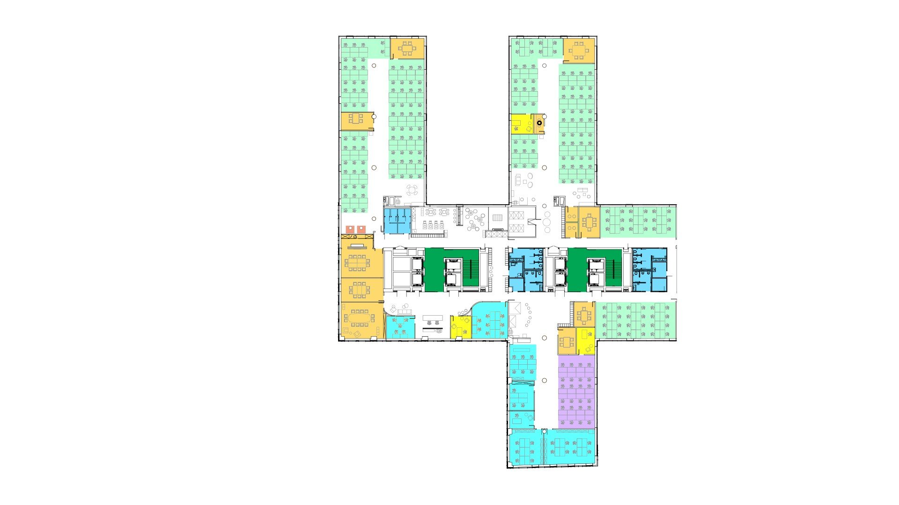

# doorkeeper
Application for managing gradual returning of employees after the COVID-19 home office period

## API
[OpenAPI documentation](https://github.com/kmozsi/doorkeeper/blob/master/src/main/resources/api.yaml)

The REST endpoints require a valid JWT token in `X-Token` header to identify the user.
Example tokens (valid until 2021) can be found in [json test data file](https://github.com/kmozsi/doorkeeper/blob/master/src/test/resources/test_tokens.json).

A valid JWT token's payload must contain:
- **userId:** Unique identifier of the user
- **roles:** Array of authorization roles (available roles: EMPLOYEE, HR)
- **exp:** expiration of the token

The secret key for generating a valid token can be found in [application.yaml](https://github.com/kmozsi/doorkeeper/blob/master/src/main/resources/application.yaml)

## Office Map

Doorkeper requires some rules about the map:
- Chairs and desks can be rotated by 90° only
- Chairs and desks cannot be resized
- Only the colors available in the map above can be used

*Note: There were no modifications made on the original office picture.*

## Running the application
The application requires a running kafka (with zookeper). To be able to access kafka,
`KAFKA_LOCATION` environment variable is required. By default it is `localhost:9092`.

:exclamation: Unfortunately, we are not able to run Doorkeper in docker, because OpenCV casuses some exceptions. Please run Doorkeper independently with maven (or an IDE).

### Run kafka with docker
To run kafka independently, execute the following command in the
project's root directory:
```
docker-compose -f kafka-docker.yml up -d
```

### Running Doorkeper with maven
Run the following commands in the project's root directory:
```
mvn spring-boot:run
```

### ~~Running everything in a docker compose~~
To run Doorkeper and all its dependent services (kafka, zookeper),
execute the following command in the project's root directory:
```
mvn clean install -P docker
docker-compose up -d
```

### ~~Running Doorkeper with docker~~
Run the following commands in the project's root directory:
```
mvn clean install -P docker
docker run -p 8080:8080 -t com.karanteam/doorkeeper:1.0.0
```

## Testing the application
### Unit tests
There are several unit tests that can be checked with maven:
```
mvn test
```

### Postman tests
Some test cases are implemented with postman. To use it, import [postman collection](https://github.com/kmozsi/doorkeeper/blob/master/src/test/resources/Doorkeper.postman_collection.json) and use the [data file](https://github.com/kmozsi/doorkeeper/blob/master/src/test/resources/test_tokens.json) when running. 
The data file contains valid json tokens with the user's identifier.

## Tech stack
### OpenApi code generation
-  OpenApi generator Java options:
https://openapi-generator.tech/docs/generators/java/

- OpenApi configuration:
https://github.com/OpenAPITools/openapi-generator/tree/master/modules/openapi-generator-maven-plugin

- OpenCV:
  - OpenCV is used the process images (office map) 
  - https://github.com/openpnp/opencv
 
- Kafka

### H2 Database
Only for development.
H2 console is available at http://localhost:8080/h2-console/

## What to do next
- Features
  - **Delete registration:** Users could be able to cancel booking
  - **Date handling:** Users could be able to book for another day
  - **Lunch time:** Users could leave the office for a limited time, but still have an active booking. This could allow the user to go for a quick lunch :blush:
  - **Office and capacity change:** Currently the map of the office and the capacity
  cannot be modified while there are active bookings in the system.
- Technical
  - Introduce persistence and replace H2 database
  
